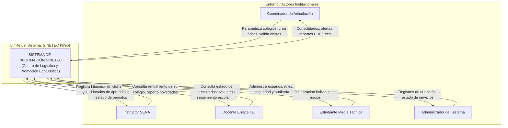
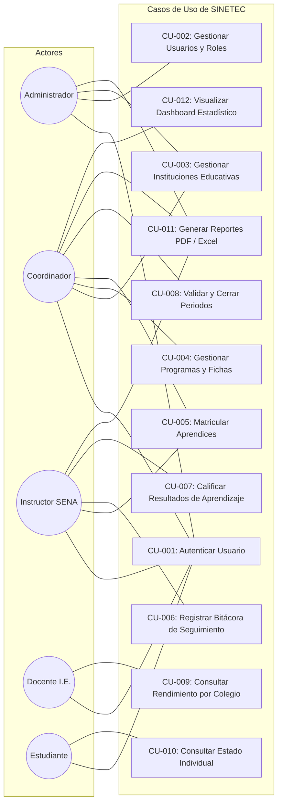
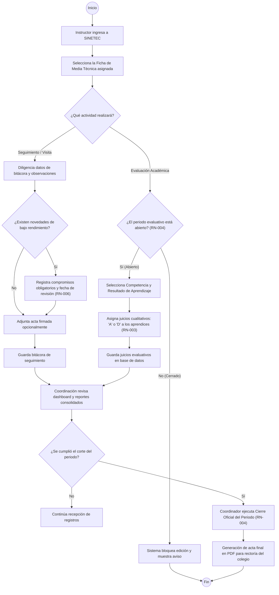
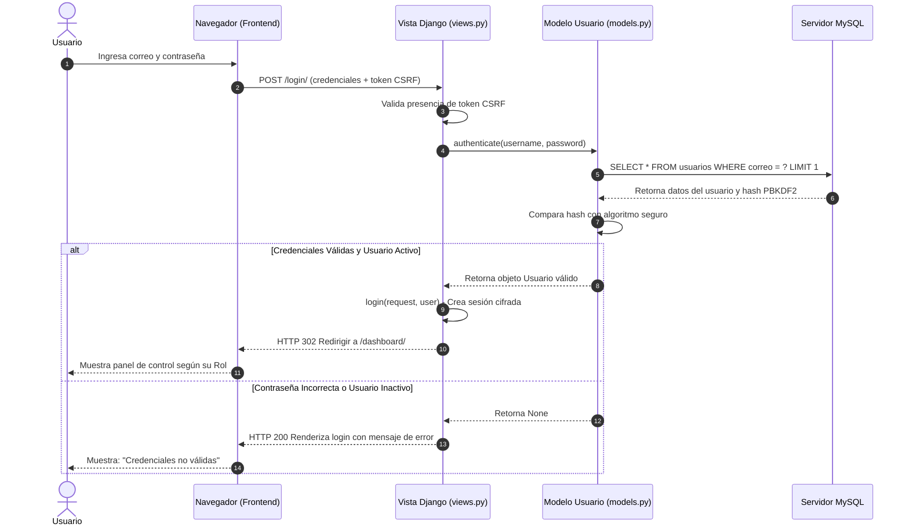
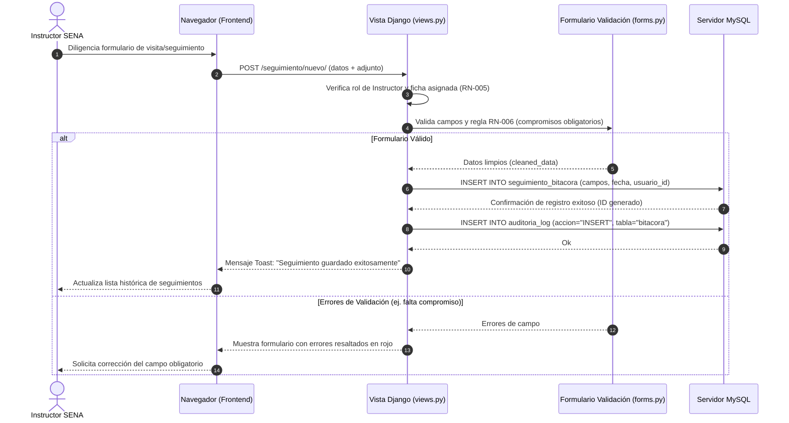
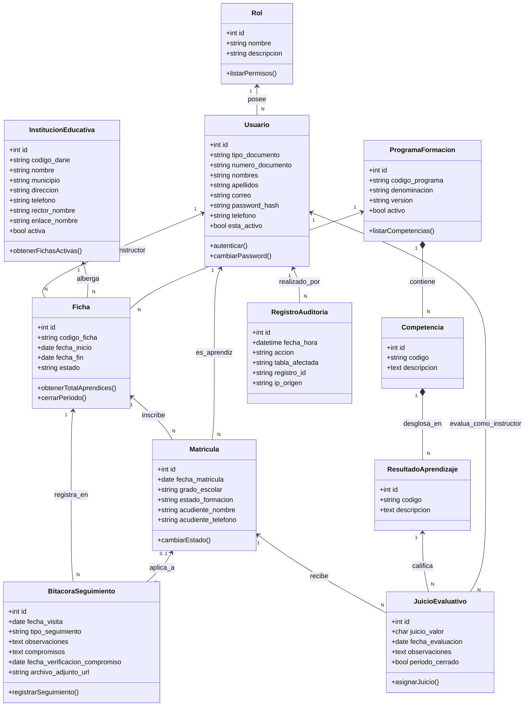

# MODELADO Y DISEÑO DEL SISTEMA (UML)
### SISTEMA SINETEC – PROYECTO FORMATIVO ADSI (228106)
**Centro de Logística y Promoción Ecoturística del Magdalena**

---

## 1. INTRODUCCIÓN PEDAGÓGICA AL MODELADO UML

### ¿Qué es UML?
UML (*Unified Modeling Language* o Lenguaje Unificado de Modelado) es un estándar gráfico internacional utilizado en la ingeniería de software para visualizar, especificar, construir y documentar los artefactos de un sistema de información.

### ¿Para qué sirve y por qué lo necesitamos?
Así como un arquitecto dibuja los planos de un edificio antes de poner los primeros ladrillos, en el desarrollo de software necesitamos diagramas UML para:
1. Tener un plano visual claro de cómo interactúan los usuarios con el software.
2. Entender el flujo de la información antes de escribir código.
3. Evitar errores de lógica que costarían semanas de trabajo si se descubrieran durante la programación.
4. Cumplir con los entregables de diseño exigidos por el SENA en la fase de análisis y diseño de ADSI.

---

## 2. DIAGRAMA DE CONTEXTO DEL SISTEMA `[PROPUESTA]`

El diagrama de contexto delimita las fronteras de SINETEC, mostrando los actores externos que interactúan con el software y la información que intercambian:

---

## 3. DIAGRAMA GENERAL DE CASOS DE USO (UML) `[PROPUESTA]`

Este diagrama agrupa los casos de uso por paquetes funcionales, mostrando qué actor tiene acceso a cada funcionalidad del sistema:

---

## 4. DIAGRAMA DE ACTIVIDADES: PROCESO DE SEGUIMIENTO Y EVALUACIÓN `[PROPUESTA]`

Este diagrama modela el flujo de trabajo lógico desde que el instructor realiza una visita técnica a un colegio hasta que los resultados son consolidados y cerrados por la coordinación:

---

## 5. DIAGRAMAS DE SECUENCIA UML `[PROPUESTA]`

Los diagramas de secuencia muestran la interacción cronológica y los mensajes intercambiados entre el Usuario, el Navegador (Frontend), el Servidor (Backend Django) y la Base de Datos (MySQL).

### 5.1 Diagrama de Secuencia: CU-001 Autenticación de Usuario

### 5.2 Diagrama de Secuencia: CU-004 Registro de Bitácora de Seguimiento

---

## 6. DIAGRAMA DE CLASES DEL DOMINIO `[PROPUESTA]`

Representa las entidades conceptuales del sistema, sus atributos principales, métodos de negocio y las relaciones de cardinalidad:

---

## 7. APORTE A LOS RESULTADOS DE APRENDIZAJE SENA
*Esta actividad contribuye al resultado de aprendizaje relacionado con **diseñar la estructura del software mediante diagramas UML conforme a los requerimientos del cliente**, porque traduce los casos de uso y las reglas de negocio en esquemas visuales de interacción, secuencia y clases que orientan con exactitud la futura programación en Django.*
