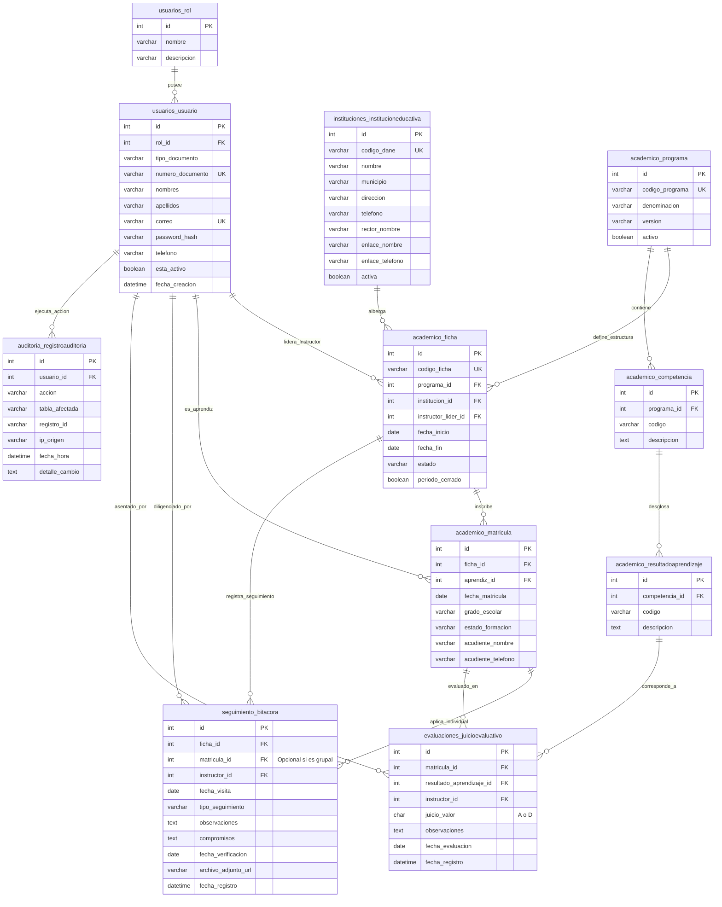

# DISEÑO DEL MODELO ENTIDAD-RELACIÓN Y BASE DE DATOS
### SISTEMA SINETEC – PROYECTO FORMATIVO ADSI
**Centro de Logística y Promoción Ecoturística del Magdalena**

---

## 1. INTRODUCCIÓN PEDAGÓGICA A LAS BASES DE DATOS RELACIONALES

### ¿Qué es un Modelo Entidad-Relación (MER)?
Es una técnica de modelado visual que permite representar cómo se estructuran y se vinculan los datos de una organización mediante **Entidades** (cosas u objetos del mundo real sobre los que guardamos información, como *Aprendiz*, *Colegio*, *Ficha*) y **Relaciones** (cómo se asocian entre sí, por ejemplo: un aprendiz *pertenece* a una ficha).

### ¿Para qué sirve y por qué lo necesitamos?
1. **Evita la redundancia:** Sin un buen diseño, el nombre de un colegio o de una competencia tendría que repetirse miles de veces en cada nota, gastando espacio y provocando errores tipográficos.
2. **Garantiza la Integridad Referencial:** Impide que existan "notas huérfanas" (notas asignadas a un estudiante que no existe o a una ficha eliminada).
3. **Optimiza la velocidad:** Permite que MySQL realice búsquedas y reportes en fracciones de segundo mediante índices estructurados.

---

## 2. PROCESO DE NORMALIZACIÓN (1FN, 2FN, 3FN) `[PROPUESTA]`

Para garantizar que nuestra base de datos sea profesional y de alta calidad, aplicamos rigurosamente las tres primeras formas normales:

### Primera Forma Normal (1FN): Atomicidad y eliminación de grupos repetitivos
* **Regla:** Cada columna debe contener un único valor indivisible (atómico) y no deben existir arreglos o listas de valores en una sola celda.
* **Aplicación en SINETEC:** En lugar de guardar los nombres y apellidos juntos en un campo `nombre_completo = "Carlos Andrés Pérez Gómez"`, se separan en `nombres` y `apellidos`. En lugar de guardar múltiples teléfonos separados por comas, se definen campos específicos o tablas de contacto.

### Segunda Forma Normal (2FN): Dependencia funcional completa
* **Regla:** Estar en 1FN y asegurar que todos los atributos que no son clave primaria dependan por completo de la clave primaria, y no de una parte de ella (en claves compuestas).
* **Aplicación en SINETEC:** En la tabla intermedia `academico_matricula` (que asocia un aprendiz con una ficha), los datos del colegio no se guardan en la matrícula, pues el colegio depende de la ficha, no del aprendiz directamente.

### Tercera Forma Normal (3FN): Eliminación de dependencias transitivas
* **Regla:** Estar en 2FN y asegurar que ningún atributo no clave dependa de otro atributo no clave (evitar dependencias indirectas).
* **Aplicación en SINETEC:** En la tabla `academico_ficha`, guardamos únicamente el `programa_id` (llave foránea). No guardamos el `nombre_programa` ni la `version_programa` dentro de la ficha, ya que esos datos pertenecen a la tabla independiente `academico_programa`.

---

## 3. DIAGRAMA ENTIDAD-RELACIÓN (MER) EN MERMAID `[PROPUESTA]`

El siguiente esquema detalla las 11 entidades normalizadas que conformarán la base de datos `sinetec_db` en MySQL Server:

---

## 4. JUSTIFICACIÓN DE LAS RELACIONES Y CARDINALIDADES `[PROPUESTA]`

1. **`usuarios_rol` (1) a `usuarios_usuario` (N):**  
   Un rol (Administrador, Coordinador, etc.) puede pertenecer a muchos usuarios, pero un usuario en esta etapa formativa tiene asignado un rol primario bien definido para simplificar la gestión de accesos.
2. **`instituciones_institucioneducativa` (1) a `academico_ficha` (N):**  
   Un colegio articulado puede tener múltiples fichas técnicas en formación (ejemplo: Técnico en Sistemas en la mañana y Técnico en Contabilidad en la tarde), pero cada ficha opera físicamente en una sola institución.
3. **`academico_programa` (1) a `academico_competencia` (N) y `academico_competencia` (1) a `academico_resultadoaprendizaje` (N):**  
   Refleja exactamente la estructura pedagógica oficial del SENA: Un programa formativo se compone de competencias laborales, y cada competencia se subdivide en varios resultados de aprendizaje evaluables.
4. **`academico_ficha` (1) a `academico_matricula` (N) y `usuarios_usuario` (1) a `academico_matricula` (N):**  
   Tabla intermedia de rompimiento que permite registrar la historia académica del aprendiz en una ficha específica, su grado escolar (10° u 11°) y su estado (En Formación, Desertado, Cancelado).
5. **`academico_matricula` (1) a `evaluaciones_juicioevaluativo` (N):**  
   Un aprendiz matriculado recibe múltiples juicios evaluativos conforme avanza en los resultados de aprendizaje de su ficha técnica.
6. **`seguimiento_bitacora`:**  
   Vinculada obligatoriamente a una `ficha_id`, y opcionalmente a un aprendiz (`matricula_id NULL`), lo que permite registrar visitas institucionales generales para todo el salón o seguimientos individuales por problemas de bajo rendimiento.

---

## 5. APORTE A LOS RESULTADOS DE APRENDIZAJE SENA
*Esta actividad contribuye al resultado de aprendizaje relacionado con **diseñar la estructura de la base de datos relacional aplicando normas de normalización y modelos entidad-relación**, porque transforma los requerimientos de información en un modelo relacional en 3FN que asegura la integridad de los registros académicos.*
