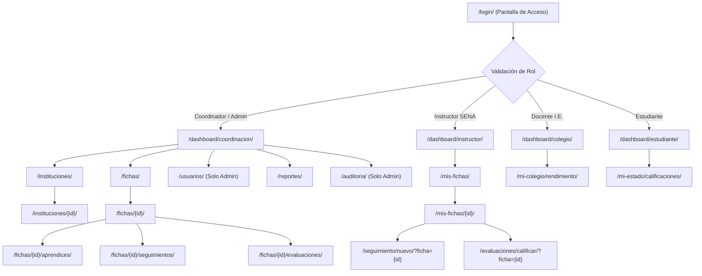

# ARQUITECTURA DE INFORMACIÓN Y MAPA DE NAVEGACIÓN
### SISTEMA SINETEC – PROYECTO FORMATIVO ADSI
**Centro de Logística y Promoción Ecoturística del Magdalena**

---

## 1. INTRODUCCIÓN PEDAGÓGICA A LA ARQUITECTURA DE INFORMACIÓN

### ¿Qué es la Arquitectura de Información (AI)?
Es la disciplina que organiza, estructura y etiqueta los contenidos y funcionalidades de un software para que los usuarios encuentren lo que buscan de manera lógica, rápida y sin frustración.

### ¿Para qué sirve y por qué la necesitamos?
1. **Evita la confusión del usuario:** Si un instructor entra a registrar una visita de seguimiento, no debe perderse entre 10 menús desordenados.
2. **Garantiza la regla de los 3 clics:** Establece que cualquier tarea crítica del sistema debe poder realizarse en un máximo de 3 clics desde el inicio.
3. **Optimiza el desarrollo:** Permite a los programadores saber exactamente qué pantallas existen, cómo se interconectan y qué menús deben mostrarse según el rol.

---

## 2. TAXONOMÍA Y ESTRUCTURA JERÁRQUICA DE SINETEC `[PROPUESTA]`

La información en SINETEC se clasifica en 4 grandes niveles organizacionales:

```mermaid
graph TD
    ROOT["SINETEC Web"] --> MOD_AUTH["Nivel 0: Acceso y Seguridad"]
    ROOT --> MOD_GESTION["Nivel 1: Gestión Institucional"]
    ROOT --> MOD_ACAD["Nivel 2: Operación Académica"]
    ROOT --> MOD_ANALISIS["Nivel 3: Análisis y Salidas"]

    MOD_AUTH --> L1["Inicio de Sesión"]
    MOD_AUTH --> L2["Recuperación de Contraseña"]
    MOD_AUTH --> L3["Gestión de Perfil de Usuario"]

    MOD_GESTION --> G1["Colegios Articulados"]
    MOD_GESTION --> G2["Programas de Formación"]
    MOD_GESTION --> G3["Fichas de Media Técnica"]
    MOD_GESTION --> G4["Cuentas de Usuarios y Roles"]

    MOD_ACAD --> A1["Matrícula de Aprendices"]
    MOD_ACAD --> A2["Bitácoras de Seguimiento"]
    MOD_ACAD --> A3["Evaluación de Resultados (RAP)"]
    MOD_ACAD --> A4["Novedades de Formación"]

    MOD_ANALISIS --> R1["Dashboard de Indicadores"]
    MOD_ANALISIS --> R2["Reportes en PDF (Actas / Fichas)"]
    MOD_ANALISIS --> R3["Exportaciones a Excel"]
    MOD_ANALISIS --> R4["Bitácora de Auditoría"]
```

---

## 3. MAPA DE NAVEGACIÓN GENERAL DEL SISTEMA `[PROPUESTA]`

El siguiente mapa muestra las rutas de navegación que el usuario puede recorrer dentro de la aplicación web:

---

## 4. MATRIZ DE VISIBILIDAD DE PANTALLAS POR ROL `[PROPUESTA]`

| Pantalla / Vista del Sistema | Administrador | Coordinador | Instructor | Docente I.E. | Estudiante |
| :--- | :---: | :---: | :---: | :---: | :---: |
| **Inicio de Sesión (`/login/`)** | SÍ | SÍ | SÍ | SÍ | SÍ |
| **Dashboard Ejecutivo General** | SÍ | SÍ | - | - | - |
| **Dashboard de Mis Fichas** | SÍ | SÍ | SÍ | - | - |
| **Dashboard de Colegio Local** | - | - | - | SÍ | - |
| **Dashboard Individual de Aprendiz** | - | - | - | - | SÍ |
| **Directorio de Colegios (`/instituciones/`)** | SÍ (CRUD) | SÍ (CRUD) | Solo Lectura | Su I.E. | - |
| **Apertura de Fichas (`/fichas/nueva/`)** | SÍ | SÍ | - | - | - |
| **Registro de Aprendices (Matrícula)** | SÍ | SÍ | SÍ (Su ficha)| - | - |
| **Bitácora de Seguimiento (Crear/Editar)** | SÍ | SÍ | SÍ (Su ficha)| - | - |
| **Calificación de Resultados (Evaluar)** | SÍ | SÍ | SÍ (Su ficha)| - | - |
| **Cierre Formal de Periodos** | SÍ | SÍ | - | - | - |
| **Generador de Reportes (PDF/Excel)** | SÍ | SÍ | SÍ (Su ficha)| Solo su I.E.| - |
| **Gestión de Cuentas de Usuarios** | SÍ | - | - | - | - |
| **Pista de Auditoría de Base de Datos** | SÍ | SÍ (Lectura) | - | - | - |

---

## 5. APORTE A LOS RESULTADOS DE APRENDIZAJE SENA
*Esta actividad contribuye al resultado de aprendizaje relacionado con **diseñar la arquitectura de información y la navegación del sistema de información**, porque estructura el mapa del sitio web y los privilegios de navegación de acuerdo con los roles organizacionales del SENA.*
