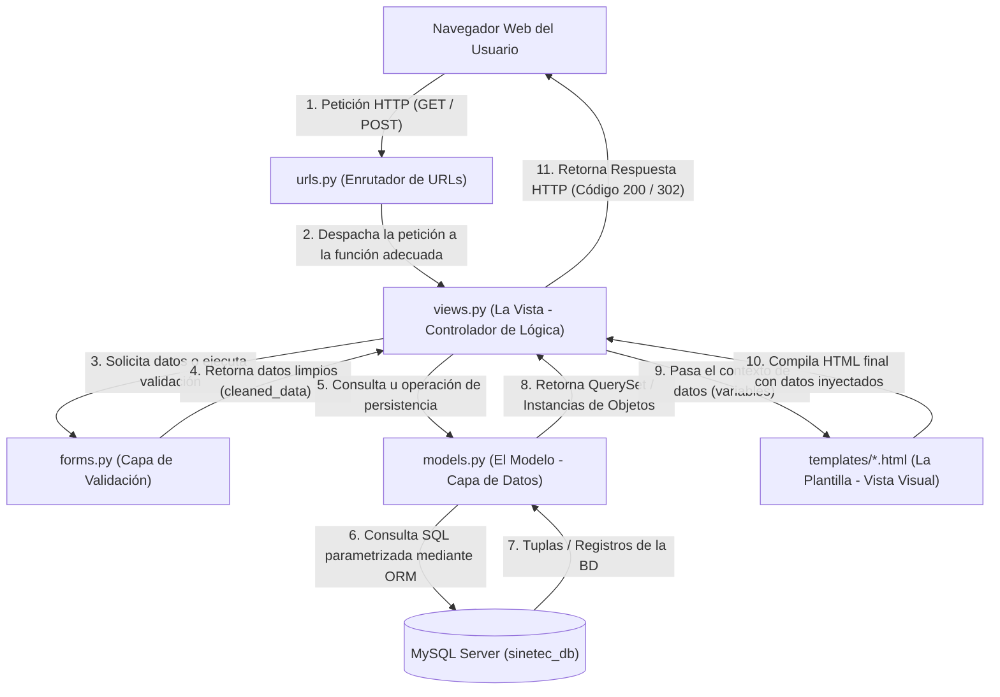
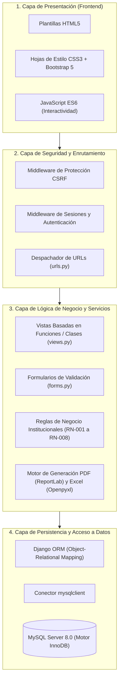

# DOCUMENTO DE ARQUITECTURA DE SOFTWARE (SAD)
### SISTEMA SINETEC – PROYECTO FORMATIVO ADSI (228106)
**Centro de Logística y Promoción Ecoturística del Magdalena**

---

## 1. INTRODUCCIÓN PEDAGÓGICA A LA ARQUITECTURA DE SOFTWARE

### ¿Qué es la Arquitectura de Software?
Es el conjunto de patrones, decisiones estructurales, directrices y componentes sobre los cuales se construye un sistema de información. Define cómo se dividen las responsabilidades del código y cómo interactúan las distintas capas (presentación, lógica y datos).

### ¿Por qué la necesitamos en SINETEC?
1. **Evita el "código espagueti":** Sin arquitectura, los programadores novatos suelen mezclar consultas a la base de datos dentro del código visual HTML, haciendo imposible corregir un error sin romper todo el sistema.
2. **Facilita el mantenimiento y la escalabilidad:** Si en el futuro el SENA decide cambiar el diseño visual o agregar un módulo de actas de comité, se hace de manera aislada sin tocar la lógica de negocio ni la base de datos.
3. **Es el núcleo de evaluación en ADSI:** Los jurados del SENA exigen comprender la justificación técnica de la arquitectura seleccionada.

---

## 2. PATRÓN ARQUITECTÓNICO: MODELO - TEMPLATE - VISTA (MTV) `[PROPUESTA]`

Django implementa una variante optimizada del patrón estándar MVC (*Model-View-Controller*), denominada **MTV**:

### Desglose de Componentes MTV para el Aprendiz:
* **El Modelo (`models.py`):** Es la representación en código Python de las tablas de MySQL. Define qué campos existen y sus tipos. Gracias al **ORM** (*Object-Relational Mapping*), no escribimos sentencias SQL a mano en el código, sino objetos de Python como `Ficha.objects.filter(activa=True)`.
* **La Plantilla / Template (`.html`):** Es el archivo visual que se muestra en pantalla. Utiliza HTML5, CSS3, Bootstrap y el motor de plantillas de Django (*Django Template Language - DTL*) para mostrar variables dinámicas con etiquetas como `{{ usuario.nombres }}` o bucles ``.
* **La Vista (`views.py`):** Es el intermediario o cerebro del proceso. Recibe la petición del usuario, consulta los datos al Modelo, aplica las reglas de negocio (ej. verifica si el periodo está cerrado con la regla RN-004) y decide qué plantilla renderizar.
* **El Enrutador (`urls.py`):** Es la guía telefónica del sistema. Asocia una dirección URL que el usuario escribe en el navegador (como `/seguimiento/nuevo/`) con la función exacta en `views.py` que debe procesarla.
* **Los Formularios (`forms.py`):** Validan automáticamente que los datos ingresados no estén vacíos, que los correos tengan formato válido y aplican reglas condicionales (como la obligatoriedad de compromisos si hay bajo rendimiento).

---

## 3. CAPAS DE LA ARQUITECTURA DEL SOFTWARE `[PROPUESTA]`

SINETEC se organiza en una arquitectura lógica de **4 capas desacopladas**:

---

## 4. ESTRATEGIAS DE SEGURIDAD EN LA ARQUITECTURA `[PROPUESTA]`

1. **Mitigación de Inyección SQL:** El uso del ORM de Django parametriza todas las consultas de forma automática, imposibilitando que texto ingresado por el usuario sea ejecutado como comandos SQL en MySQL.
2. **Mitigación de Cross-Site Request Forgery (CSRF):** Todo formulario que altere el estado de los datos (POST/PUT/DELETE) incluye un token criptográfico único por sesión (``).
3. **Mitigación de Cross-Site Scripting (XSS):** El motor de plantillas de Django escapa por defecto cualquier carácter peligroso (`<`, `>`, `&`, `"`) introducido por usuarios.
4. **Cifrado de Contraseñas:** Uso exclusivo de algoritmos hash de un solo sentido (PBKDF2 con SHA-256) con salado (*salt*) aleatorio.
5. **Control de Acceso Basado en Roles (RBAC):** Decoradores de autorización en las vistas (`@login_required`, `@user_passes_test`) que rechazan peticiones no autorizadas con código `HTTP 403 Prohibido`.

---

## 5. APORTE A LOS RESULTADOS DE APRENDIZAJE SENA
*Esta actividad contribuye al resultado de aprendizaje relacionado con **definir la arquitectura del software de acuerdo con el patrón de diseño seleccionado y los requisitos del sistema**, porque fundamenta las decisiones tecnológicas del patrón MTV y la separación en capas requerida para la fase de construcción en ADSI.*
