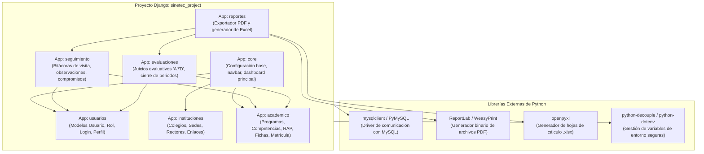
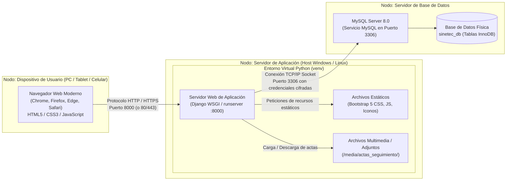

# DIAGRAMAS DE COMPONENTES Y DESPLIEGUE (UML)
### SISTEMA SINETEC – PROYECTO FORMATIVO ADSI (228106)
**Centro de Logística y Promoción Ecoturística del Magdalena**

---

## 1. INTRODUCCIÓN PEDAGÓGICA A LOS DIAGRAMAS FÍSICOS Y ESTRUCTURALES

### ¿Qué es un Diagrama de Componentes?
Muestra la organización del código fuente en bloques lógicos independientes y reutilizables llamados **Componentes** (en Django, cada componente es una *App* o aplicación desacoplada).

### ¿Qué es un Diagrama de Despliegue?
Muestra la arquitectura física de hardware y red: en qué computadores o servidores se ejecuta cada parte del sistema (servidor web, servidor de base de datos, navegador del cliente).

---

## 2. DIAGRAMA DE COMPONENTES DEL SOFTWARE (DJANGO APPS) `[PROPUESTA]`

SINETEC se estructurará modularmente en **7 aplicaciones Django**, evitando proyectos monolíticos desordenados:

---

## 3. DIAGRAMA DE DESPLIEGUE DEL SISTEMA `[PROPUESTA]`

El diagrama de despliegue detalla los nodos físicos y de red en un entorno de desarrollo local y su proyección hacia un servidor de red institucional:

---

## 4. ESPECIFICACIÓN DE NODOS Y PUERTOS DE COMUNICACIÓN `[PROPUESTA]`

1. **Nodo Cliente (Navegador Web):**
   * **Requisitos:** Cualquier dispositivo con navegador estándar actualizado y conexión de red (LAN o Internet).
   * **Protocolo:** HTTP (en desarrollo local) o HTTPS (en producción institucional mediante certificado SSL).
2. **Nodo Servidor de Aplicación:**
   * **Software:** Python 3.10+, Entorno Virtual aislado (`venv`), Django 4.2 LTS.
   * **Puerto Predeterminado de Desarrollo:** `8000` (accesible en `http://127.0.0.1:8000/`).
   * **Almacenamiento de Archivos:** Carpeta `static/` para diseño y `media/` para actas de seguimiento y soportes escaneados.
3. **Nodo Servidor de Base de Datos:**
   * **Software:** MySQL Community Server 8.0.
   * **Puerto Predeterminado:** `3306`.
   * **Seguridad de Comunicación:** Usuario con permisos restringidos exclusivamente a la base de datos `sinetec_db`.

---

## 5. APORTE A LOS RESULTADOS DE APRENDIZAJE SENA
*Esta actividad contribuye al resultado de aprendizaje relacionado con **definir los componentes y el modelo de despliegue del sistema de información según los requerimientos de la infraestructura tecnológica**, porque planifica la distribución física, puertos de red y dependencias de software antes de iniciar la instalación de librerías.*
