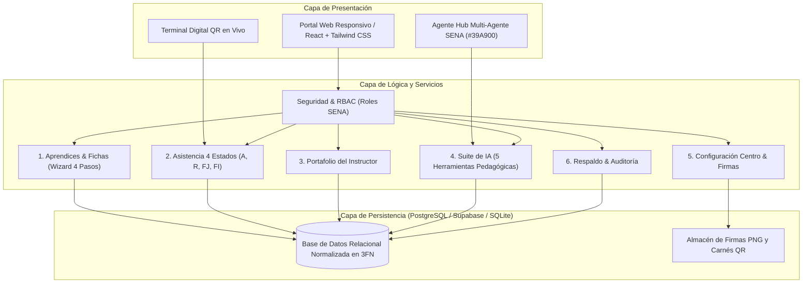

# Arquitectura del Sistema Web Integral SENA y Esquema Relacional

## 1. Arquitectura del Sistema

El sistema implementa una arquitectura modular en capas alineada con las normativas pedagógicas y administrativas del SENA (Servicio Nacional de Aprendizaje), Regional Magdalena (Sede Ciénaga).



---

## 2. Esquema Relacional DDL (PostgreSQL / Supabase)

A continuación se detalla el esquema DDL estructurado en Tercera Forma Normal (3FN), garantizando integridad referencial, índices y tipos de datos óptimos.

```sql
-- ============================================================================
-- SISTEMA INTEGRAL SENA — ESQUEMA RELACIONAL (POSTGRESQL / SUPABASE)
-- ============================================================================

-- 1. Roles y Usuarios
CREATE TABLE sena_roles (
    id SERIAL PRIMARY KEY,
    nombre VARCHAR(50) UNIQUE NOT NULL,
    descripcion TEXT
);

CREATE TABLE sena_usuarios (
    id SERIAL PRIMARY KEY,
    username VARCHAR(150) UNIQUE NOT NULL,
    password_hash VARCHAR(255) NOT NULL,
    email VARCHAR(254) UNIQUE NOT NULL,
    first_name VARCHAR(150) NOT NULL,
    last_name VARCHAR(150) NOT NULL,
    tipo_documento VARCHAR(5) DEFAULT 'CC',
    numero_documento VARCHAR(20) UNIQUE NOT NULL,
    telefono VARCHAR(20),
    rol_id INT REFERENCES sena_roles(id) ON DELETE RESTRICT,
    esta_activo BOOLEAN DEFAULT TRUE,
    fecha_creacion TIMESTAMP WITH TIME ZONE DEFAULT CURRENT_TIMESTAMP
);

-- 2. Institución y Fichas Formativas
CREATE TABLE sena_instituciones (
    id SERIAL PRIMARY KEY,
    codigo_dane VARCHAR(20) UNIQUE NOT NULL,
    nombre VARCHAR(200) NOT NULL,
    municipio VARCHAR(100) NOT NULL DEFAULT 'Ciénaga',
    direccion VARCHAR(255)
);

CREATE TABLE sena_programas (
    id SERIAL PRIMARY KEY,
    codigo_programa VARCHAR(20) UNIQUE NOT NULL,
    denominacion VARCHAR(200) NOT NULL,
    version VARCHAR(10) DEFAULT '1',
    activo BOOLEAN DEFAULT TRUE
);

CREATE TABLE sena_fichas (
    id SERIAL PRIMARY KEY,
    codigo_ficha VARCHAR(20) UNIQUE NOT NULL,
    programa_id INT REFERENCES sena_programas(id) ON DELETE PROTECT,
    institucion_id INT REFERENCES sena_instituciones(id) ON DELETE PROTECT,
    instructor_lider_id INT REFERENCES sena_usuarios(id) ON DELETE PROTECT,
    fecha_inicio DATE NOT NULL,
    fecha_fin DATE NOT NULL,
    modalidad VARCHAR(20) DEFAULT 'Presencial',
    jornada VARCHAR(20) DEFAULT 'Diurna',
    estado VARCHAR(20) DEFAULT 'En Ejecucion',
    periodo_cerrado BOOLEAN DEFAULT FALSE
);

-- 3. Matrícula y Caracterización Poblacional del Aprendiz
CREATE TABLE sena_matriculas (
    id SERIAL PRIMARY KEY,
    ficha_id INT REFERENCES sena_fichas(id) ON DELETE CASCADE,
    aprendiz_id INT REFERENCES sena_usuarios(id) ON DELETE RESTRICT,
    grado_escolar VARCHAR(5) DEFAULT '10',
    estado_formacion VARCHAR(25) DEFAULT 'En Formacion',
    etapa_actual VARCHAR(20) DEFAULT 'Lectiva',
    grupo_etnico VARCHAR(50) DEFAULT 'Ninguno',
    condicion_discapacidad VARCHAR(50) DEFAULT 'Ninguna',
    poblacion_vulnerable VARCHAR(50) DEFAULT 'No',
    eps_sisben VARCHAR(100),
    empresa_patrocinadora VARCHAR(200),
    fecha_matricula DATE DEFAULT CURRENT_DATE,
    CONSTRAINT uq_ficha_aprendiz UNIQUE (ficha_id, aprendiz_id)
);

-- 4. Competencias y Resultados de Aprendizaje (RAP)
CREATE TABLE sena_competencias (
    id SERIAL PRIMARY KEY,
    programa_id INT REFERENCES sena_programas(id) ON DELETE CASCADE,
    codigo VARCHAR(20) NOT NULL,
    descripcion TEXT NOT NULL
);

CREATE TABLE sena_raps (
    id SERIAL PRIMARY KEY,
    competencia_id INT REFERENCES sena_competencias(id) ON DELETE CASCADE,
    codigo VARCHAR(20) NOT NULL,
    descripcion TEXT NOT NULL
);

-- 5. Asistencia en 4 Estados Oficiales SENA
CREATE TABLE sena_asistencias (
    id SERIAL PRIMARY KEY,
    matricula_id INT REFERENCES sena_matriculas(id) ON DELETE CASCADE,
    fecha DATE NOT NULL,
    estado VARCHAR(2) NOT NULL CHECK (estado IN ('A', 'R', 'FJ', 'FI')),
    observaciones TEXT,
    soporte_incapacidad_url VARCHAR(255),
    registrado_por_id INT REFERENCES sena_usuarios(id) ON DELETE PROTECT,
    fecha_registro TIMESTAMP WITH TIME ZONE DEFAULT CURRENT_TIMESTAMP,
    CONSTRAINT uq_asistencia_diaria UNIQUE (matricula_id, fecha)
);

-- 6. Juicios Evaluativos Oficiales
CREATE TABLE sena_juicios_evaluativos (
    id SERIAL PRIMARY KEY,
    matricula_id INT REFERENCES sena_matriculas(id) ON DELETE CASCADE,
    rap_id INT REFERENCES sena_raps(id) ON DELETE PROTECT,
    instructor_id INT REFERENCES sena_usuarios(id) ON DELETE PROTECT,
    juicio_valor VARCHAR(1) NOT NULL CHECK (juicio_valor IN ('A', 'D')),
    observaciones TEXT,
    fecha_evaluacion DATE NOT NULL,
    CONSTRAINT uq_juicio_rap UNIQUE (matricula_id, rap_id)
);

-- 7. Alertas Tempranas y Comités de Evaluación (Acuerdo 007/2012)
CREATE TABLE sena_comites_alertas (
    id SERIAL PRIMARY KEY,
    matricula_id INT REFERENCES sena_matriculas(id) ON DELETE CASCADE,
    motivo VARCHAR(255) NOT NULL,
    fallas_injustificadas INT DEFAULT 0,
    fase VARCHAR(30) DEFAULT 'IDENTIFICADA',
    acta_numero VARCHAR(50),
    compromisos_texto TEXT,
    fecha_citacion DATE,
    fecha_deteccion DATE DEFAULT CURRENT_DATE
);
```

---

## 3. Componentes Clave en React con Tailwind CSS

### Componente 1: Marcador Ágil de Asistencia (4 Estados Oficiales)

```tsx
import React, { useState } from 'react';

type EstadoAsistencia = 'A' | 'R' | 'FJ' | 'FI';

interface AprendizRow {
  id: number;
  nombre: string;
  documento: string;
  estado: EstadoAsistencia;
  observaciones: string;
}

export const AsistenciaTableSena: React.FC = () => {
  const [aprendices, setAprendices] = useState<AprendizRow[]>([
    { id: 1, nombre: 'Carlos Mendoza', documento: '1083401122', estado: 'A', observaciones: '' },
    { id: 2, nombre: 'Ana María Gómez', documento: '1083402233', estado: 'A', observaciones: '' },
  ]);

  const cambiarEstado = (id: number, nuevoEstado: EstadoAsistencia) => {
    setAprendices(prev => prev.map(a => a.id === id ? { ...a, estado: nuevoEstado } : a));
  };

  const getButtonClass = (actual: EstadoAsistencia, objetivo: EstadoAsistencia, color: string) => {
    const isSelected = actual === objetivo;
    return `px-3 py-1 text-xs font-bold rounded-lg transition-all ${
      isSelected ? `${color} text-white shadow-md scale-105` : 'bg-gray-100 text-gray-700 hover:bg-gray-200'
    }`;
  };

  return (
    <div className="bg-white rounded-2xl shadow-sm border border-gray-100 p-6">
      <div className="flex justify-between items-center mb-4">
        <div>
          <h2 className="text-lg font-bold text-gray-900">Control de Asistencia Formativa</h2>
          <p className="text-xs text-gray-500">Estados oficiales SENA: [A] Asistió · [R] Retardo · [FJ] Justificada · [FI] Injustificada</p>
        </div>
        <button className="bg-[#39A900] hover:bg-[#2d8500] text-white px-5 py-2 text-sm font-bold rounded-full shadow-lg">
          Guardar Asistencia
        </button>
      </div>

      <table className="w-full text-left border-collapse">
        <thead>
          <tr className="border-b border-gray-100 text-xs font-bold text-gray-500 uppercase">
            <th className="py-3">Aprendiz</th>
            <th className="py-3 text-center">Marcación Oficial</th>
            <th className="py-3">Observaciones</th>
          </tr>
        </thead>
        <tbody className="divide-y divide-gray-50 text-sm">
          {aprendices.map(a => (
            <tr key={a.id} className="hover:bg-gray-50/60">
              <td className="py-3">
                <span className="font-semibold text-gray-900 block">{a.nombre}</span>
                <span className="text-xs text-gray-400">CC {a.documento}</span>
              </td>
              <td className="py-3 text-center">
                <div className="inline-flex gap-1.5 p-1 bg-gray-50 rounded-xl">
                  <button onClick={() => cambiarEstado(a.id, 'A')} className={getButtonClass(a.estado, 'A', 'bg-[#39A900]')}>[A]</button>
                  <button onClick={() => cambiarEstado(a.id, 'R')} className={getButtonClass(a.estado, 'R', 'bg-amber-500')}>[R]</button>
                  <button onClick={() => cambiarEstado(a.id, 'FJ')} className={getButtonClass(a.estado, 'FJ', 'bg-blue-600')}>[FJ]</button>
                  <button onClick={() => cambiarEstado(a.id, 'FI')} className={getButtonClass(a.estado, 'FI', 'bg-red-500')}>[FI]</button>
                </div>
              </td>
              <td className="py-3">
                <input
                  type="text"
                  placeholder="Detalle o soporte..."
                  className="w-full text-xs px-3 py-1.5 bg-gray-50 border border-gray-200 rounded-lg focus:outline-none focus:border-[#39A900]"
                />
              </td>
            </tr>
          ))}
        </tbody>
      </table>
    </div>
  );
};
```

### Componente 2: Runner de Productividad e Inteligencia Artificial SENA

```tsx
import React, { useState } from 'react';

export const SuiteIARunner: React.FC = () => {
  const [herramienta, setHerramienta] = useState('1');
  const [tema, setTema] = useState('Patrones de Arquitectura de Software');
  const [loading, setLoading] = useState(false);
  const [resultado, setResultado] = useState('');

  const ejecutarIA = async () => {
    setLoading(true);
    setResultado('Analizando diseño curricular SENA y generando planeación...');
    try {
      const resp = await fetch('/sena/api/generar-ia/', {
        method: 'POST',
        headers: { 'Content-Type': 'application/json' },
        body: JSON.stringify({ herramienta, tema, duracion: '45', fase: 'Ejecución' })
      });
      const data = await resp.json();
      setResultado(data.contenido);
    } finally {
      setLoading(false);
    }
  };

  return (
    <div className="grid grid-cols-1 lg:grid-cols-12 gap-6">
      <div className="lg:col-span-5 bg-white p-6 rounded-2xl border border-gray-100 shadow-sm">
        <h3 className="font-bold text-gray-900 mb-2">Suite de Productividad IA</h3>
        <select
          value={herramienta}
          onChange={e => setHerramienta(e.target.value)}
          className="w-full text-sm p-3 border border-gray-200 rounded-xl mb-4 focus:ring-2 focus:ring-[#39A900]"
        >
          <option value="1">1. Planificador Semanal Inteligente</option>
          <option value="2">2. Generador de Sesiones Express (4 Momentos)</option>
          <option value="3">3. Automatizador de Tareas e Informes</option>
          <option value="4">4. Recursos y Guías Didácticas</option>
          <option value="5">5. Coach de Productividad & Tiempo</option>
        </select>
        <button
          onClick={ejecutarIA}
          disabled={loading}
          className="w-full bg-[#39A900] text-white py-3 rounded-xl font-bold hover:bg-[#2e8600] transition"
        >
          {loading ? 'Generando...' : 'Generar con IA SENA'}
        </button>
      </div>

      <div className="lg:col-span-7 bg-white p-6 rounded-2xl border border-gray-100 shadow-sm flex flex-col">
        <h4 className="font-bold text-gray-900 mb-2">Resultado Estructurado</h4>
        <pre className="flex-1 bg-gray-50 p-4 rounded-xl text-xs text-gray-800 overflow-auto whitespace-pre-wrap font-sans">
          {resultado || 'Presiona generar para visualizar el entregable.'}
        </pre>
      </div>
    </div>
  );
};
```

---

## 4. Especificación de Endpoints REST para IA y Reportes

| Endpoint | Método | Descripción | Parámetros Clave |
| :--- | :---: | :--- | :--- |
| `/sena/api/guardar-asistencia/` | `POST` | Asienta la asistencia diaria por ficha en 4 estados oficiales. | `ficha_id`, `fecha`, `asistencias: [{ matricula_id, estado, observaciones }]` |
| `/sena/api/registrar-aprendiz/` | `POST` | Ejecuta el alta del aprendiz mediante el wizard en 4 pasos. | `nombres`, `apellidos`, `tipo_doc`, `numero_doc`, `ficha_id`, `grado` |
| `/sena/api/generar-ia/` | `POST` | Invoca el motor de síntesis de las 5 herramientas de productividad. | `herramienta` (1 a 5), `tema`, `duracion`, `fase` |
| `/sena/api/exportar-datos/?formato=json` | `GET` | Descarga respaldo completo de la base de datos en formato JSON. | `formato=json` o `formato=csv` |
| `/academico/fichas/<id>/reporte-pdf/` | `GET` | Genera la sábana de juicios evaluativos y RAPs en PDF membretado. | `pk` (ID de la Ficha) |
| `/asistente/consulta/` | `POST` | Motor conversacional del Agente Hub Multi-Agente SENA. | `mensaje`, `accion`, `agente` (`pedagogico`, `normativo`, `alertas`, `express`, `gestion`) |
